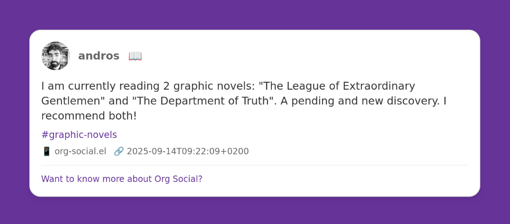

# Org Social Preview Generator

Tool for generating HTML previews from [Org Social](https://github.com/tanrax/org-social) files. This tool creates social media-like preview cards for each post in your `social.org` file.



[Link](https://andros.dev/static/preview/2025-09-14T09-22-09plus0200.html)

## Installation

No external dependencies required beyond Python 3 standard library and Jinja2:

```bash
pip install jinja2
```

## Usage

### Docker

Using Docker Compose (recommended):

```bash
# Create preview directory first
mkdir -p preview

# Copy `social.org` file to the current directory
cp /path/to/your/social.org .

# Run with Docker Compose
UID=$(id -u) GID=$(id -g) docker compose up
```

Or build and run manually:

```bash
# Create preview directory first
mkdir -p preview

docker build -t org-social-preview .
docker run -v $(pwd)/social.org:/app/social.org:ro -v $(pwd)/preview:/app/preview org-social-preview
```

**Note**: Make sure to create the `preview` directory before running Docker to avoid permission issues.

### Arguments

- `--social-file`, `-s`: Path to your social.org file (default: `social.org`)
- `--preview-dir`, `-p`: Directory to save HTML previews (default: `preview`)
- `--template-dir`, `-td`: Directory containing the template file (default: `.`)
- `--template-name`, `-tn`: Template filename (default: `template.html`)

### Local Python

Basic usage:

```bash
python org_social_preview_generator.py
```

With custom options:

```bash
python org_social_preview_generator.py --social-file my-social.org --preview-dir output --template-dir templates --template-name custom.html
```

## File Structure

```
org-social-preview/
├── org_social_preview_generator.py  # Main script
├── template.html                   # HTML template
├── social.org                     # Your Org Social file
└── preview/                       # Generated HTML files
    ├── 2025-08-14T09-11-00plus0200.html
    ├── 2025-08-14T14-29-00plus0200.html
    └── ...
```

## Template Customization

The HTML template (`template.html`) uses Jinja2 templating. You can customize:

- Styling and layout
- Open Graph metadata
- Post display format
- Color scheme and fonts

Available template variables:

- `nick`: User nickname
- `formatted_content`: Processed post content
- `mood`: Post mood emoji
- `tags`: List of tags
- `formatted_time`: Formatted timestamp
- `avatar_url`: User avatar URL
- `post_url`: Post permalink

## Technical recommendation

If you are going to use a cron job to generate them repeatedly, check the header or metadata for when the last modification was made.

## License

This project is open source. See the main [Org Social repository](https://github.com/tanrax/org-social) for more information.
